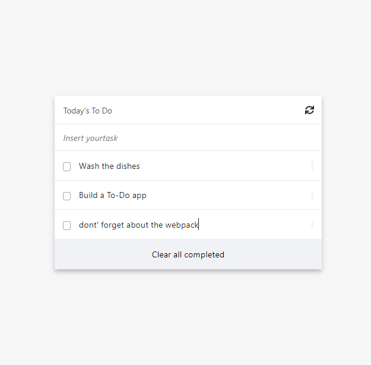

# Task's To do

## To do 

## Built With

- HTML
- SCSS
- JS
- Bootstrap 5

## Live Demo

- [Live Demo](https://iwillteixeira.github.io/to-do/)

## Getting Started

To get a local copy up and running follow these simple example steps.

`git clone git@github.com:iwillteixeira/to-do.git`

### Prerequisites

To contribute with this project you must instal the follow items:

-NODE
-NPM
-WEBPACK

### Setup

Dowload NPM and NODE
### Install

Install the packages globally and after that:

`npm install`

### Run tests

`npx hint .`
`npx stylelint "**/*.scss"`
`npx eslint .`
`npm test`
## Authors

👤 **Will Teixeira**

- GitHub: [@githubhandle](https://github.com/iwillteixeira)
- Twitter: [@twitterhandle](https://twitter.com/iwillteixeira)
- LinkedIn: [LinkedIn](https://www.linkedin.com/in/juscelino-t-39aa9049/)

## 🤝 Contributing

Contributions, issues, and feature requests are welcome!

Feel free to check the [issues page](../../issues/).

## Show your support

Give a ⭐️ if you like this project!

## Acknowledgments

- [Microverse](https://www.microverse.com)
- [FreeCodeCamp](https://www.freecodecamp.com)

## 📝 License

This project is [MIT](./MIT.md) licensed.
